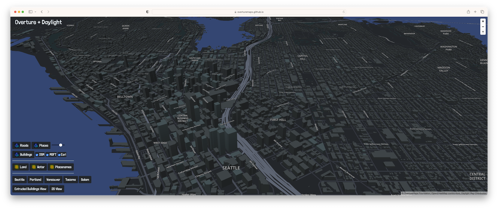

Building a basemap by complementing Overture data with OpenStreetMap features.
===



Overture data themes include `transportation`, `buildings`, `places`, and `admins`. A complete basemap, however, will need additional context layers, such as land and water.

For these _context layers_, we can look to the [Daylight Earth Table](https://daylightmap.org/earth/). This dataset is published alongside the [Daylight Map Distribution](https://daylightmap.org), and is created by extracting relevant features from Daylight and organizing them into `theme`, `class`, and `subclass`. If, for example, you are looking for all of the water in the world, you can query the `water` theme. If you only want oceans, there is an `ocean` class. Similarly, there is a `land` theme that includes natural landcover and a `landuse` theme with features relating to land developed by humans.

[Watch our Daylight Earth Table presentation at NACIS 2022](https://www.youtube.com/watch?v=7ea3KZni0AQ).

## Creating the Tilesets

### 1. Obtain the Data

This sample will focus on the Pacific Northwest in the United States. Our bounding box is:

`POLYGON((-126.7952 50.4344, -118.5453 50.4344, -118.5453 43.5453, -126.7952 43.5453, -126.7952 50.4344))`.

We can start by extracting all of the road `segments` from the transportation theme using Amazon Athena.

```sql
SELECT
    subtype,
    JSON_EXTRACT_SCALAR(road,'$.class') as class,
    JSON_EXTRACT_SCALAR(road,'$.roadNames.common[0].value') AS name,
    level,
    ST_ASTEXT(ST_GeomFromBinary(geometry)) as wkt
FROM
    transportation
WHERE type = 'segment' AND
    bbox.minX > -126.7952
    AND bbox.maxX < -118.5453
    AND bbox.minY > 43.5453
    AND bbox.maxY < 50.4344
```

This produces a 630 mb CSV file with 2M rows.

### 2. Convert the Data
Next, we can use DuckDB to turn this CSV into GeoJSONSeq. We could do additional processing here if we wanted, such as renaming columns.

```sql
COPY (
    SELECT
        subtype, class, name, level,
        ST_GeomFromText(wkt) as geometry
    FROM 'csv/pnw_segments.csv'
    ) TO 'roads.geojsonseq'
WITH (FORMAT GDAL, DRIVER 'GeoJSONSeq');
```

All of the DuckDB queries used in this example are recorded in `conversion.sql`.

### 3. Create a tileset
Use [Tippecanoe](https://github.com/felt/tippecanoe) to turn the geojson features into a `pmtiles` archive:

```
tippecanoe -fo tiles/roads.pmtiles -Z11 -z11 -l roads roads.geojsonseq
```

In this example, we will only render the tiles at zoom-level 11 and overzoom from there. A more efficient approach would be to separate different classes of roads to different zoom levels, which could be done with some additional post-processing.

### 4. Create and style the map
Maplibre can read pmtiles directly with the pmtiles protocol.
```html
<head>
    <script src="https://unpkg.com/pmtiles@2.5.0/dist/index.js"></script>`
</head>
```

Add the protcol to the map:
```javascript
let protocol = new pmtiles.Protocol();
maplibregl.addProtocol("pmtiles", protocol.tile);
```

and then reference the tileset in the source:

```javascript
style: {
    sources: {
        roads: {
            type: "vector",
            url: "pmtiles://tiles/roads.pmtiles"
        }
    }
}
```

Read the full source here: https://github.com/OvertureMaps/overture-with-daylight/blob/main/docs/index.html.


### Running Locally
This demo uses `[pmtiles](https://github.com/protomaps/PMTiles)`, so you will need a local http server that can support byte range requests with cors.

On a mac, you can run `http-server --cors .` from the `docs` directory after installing http-server:
`brew install http-server`). Then open http://127.0.0.1
